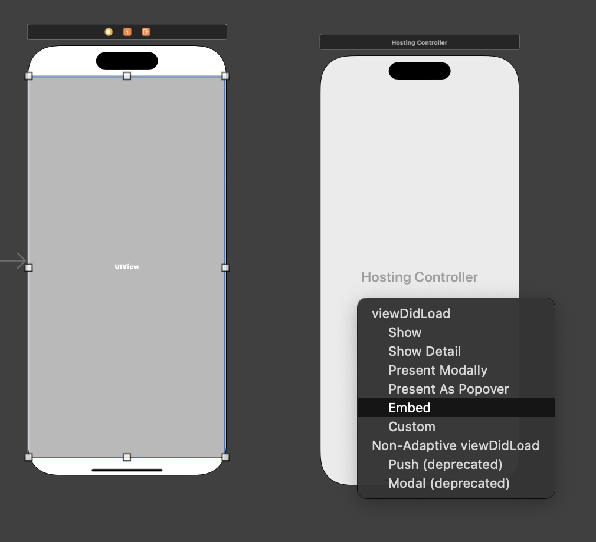

<!-- # UIKit StoryBoard에서 SwiftUI뷰 띄우기 -->

## 1.  SwiftUI 뷰를 띄울 화면에 Container View를 붙여 넣고 원하는 크기로 조절한다.


## 2.  그러면 연결된 화면이 생기는데 그 화면을 지운다.

<!--  -->
<p align="center"></p>

## 3. Hosting View Controller를 만들어서 Container View와 Control 드래그앤드랍으로 잇는다. 이을때는 Embed를 선택해준다.




## 4. cmd+n으로 SwiftUIView파일을 생성한다.


### 붙여넣을 SwiftUIView


## 5. HostingView Controller의 Class이름을 아까 만든 SwiftUIView이름으로 바꾼다.

<!--  -->
<p align="center"></p>


## 6. Container View를 붙여 넣은 화면에서 어시스턴트를 열고 HostingView Controller에 연결되 있는 화살표를 드래그앤드롭으로 어시스턴트에 연결한다.


화살표를 맞게 드래그앤드롭 했다면 **@IBAction가 아니라 @IBSegueAction이 나올 것이다.**

## 7. 아래코드를 붙여 넣는다.

```swift
@IBSegueAction func addSwiftUIView(_ coder: NSCoder) -> UIViewController? {
        return UIHostingController(coder: coder, rootView: SwiftUIView())
    }
```

## 8. 빌드해서 SwiftUI View가 잘 표시 되는걸 확인할 수 있다.

<!--  -->
<p align="center"></p>